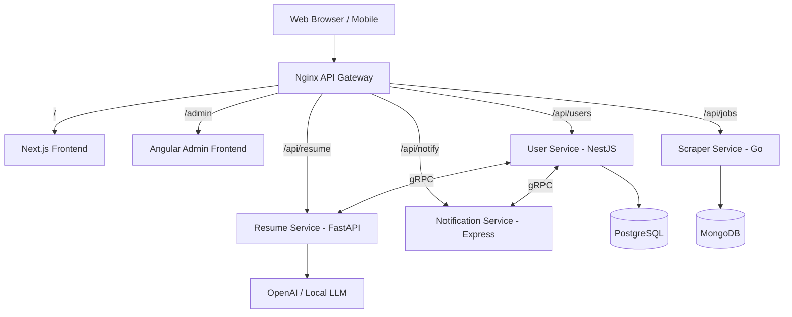

# Job Aggregator Platform: Comprehensive Architecture & Developer Roadmap

## Table of Contents
1. [Introduction & Vision](#1-introduction--vision)
2. [High-Level Architecture](#2-high-level-architecture)
3. [Infrastructure & Networking](#3-infrastructure--networking)
4. [Database Architecture & Schemas](#4-database-architecture--schemas)
5. [Microservices Specifications](#5-microservices-specifications)
6. [API Design & Contracts](#6-api-design--contracts)
7. [Coding Standards & Best Practices](#7-coding-standards--best-practices)
8. [Git Workflow & Contributing](#8-git-workflow--contributing)
9. [Testing Strategy](#9-testing-strategy)
10. [CI/CD Pipeline](#10-cicd-pipeline)
11. [Detailed Project Roadmap](#11-detailed-project-roadmap)
12. [Security Guidelines](#12-security-guidelines)

---

## 1. Introduction & Vision

The Job Aggregator Platform is a next-generation career portal designed to consolidate job listings from multiple sources across the web, parse candidate resumes using advanced AI, and algorithmically match candidates to their ideal roles.

This document serves as the absolute source of truth for the platform's architecture, best practices, and implementation roadmap. It is designed to onboard new engineers, open-source contributors, and stakeholders, ensuring that everyone adheres to industry-grade standards as the platform scales.

---

## 2. High-Level Architecture

The platform utilizes a **Microservices Architecture** housed within a single **Monorepo**. This provides the best of both worlds: strict separation of concerns for deployment and scaling, alongside an exceptional developer experience (DX) for local testing.

### 2.1 System Diagram



### 2.2 Core Technologies
- **Frontend:** Next.js (React), TailwindCSS, TypeScript
- **Admin Dashboard:** Angular, RxJS, TypeScript
- **User Service:** NestJS, TypeORM/Prisma, PostgreSQL
- **Scraper Service:** Go (Golang), Colly, MongoDB
- **Resume Parsing Service:** Python, FastAPI, spaCy / OpenAI API
- **Notification Service:** Node.js, Express, Nodemailer / SendGrid
- **Gateway & Proxy:** Nginx
- **Containerization:** Docker, Docker Compose

---

## 3. Infrastructure & Networking

### 3.1 Docker Compose Setup
Local development relies entirely on `docker-compose.yml`. No developer should need to install Go, Python, or Node locally on their bare metal to run the stack.

**Internal Network:** `microservices-net`
All services communicate over this isolated bridge network. The only port exposed to the host machine is port `80` (mapped to Nginx).

### 3.2 The API Gateway (Nginx)
Nginx acts as the reverse proxy. It prevents CORS issues, centralizes rate limiting, and hides internal topology.

**Key Configurations:**
- `client_max_body_size 10M;` (Allows resume PDF uploads)
- Route based proxying (`/api/users/` -> `http://user_service:3000/`)

---

## 4. Database Architecture & Schemas

### 4.1 PostgreSQL (Relational)
Used strictly by the **User Service** for highly structured, ACID-compliant data (users, subscriptions, roles).

**Prisma Schema Representation:**
```prisma
generator client {
  provider = "prisma-client-js"
}

datasource db {
  provider = "postgresql"
  url      = env("DATABASE_URL")
}

model User {
  id                 String    @id @default(uuid())
  email              String    @unique
  passwordHash       String
  role               Role      @default(USER)
  subscriptionStatus SubStatus @default(FREE)
  profile            Profile?
  createdAt          DateTime  @default(now())
  updatedAt          DateTime  @updatedAt
}

model Profile {
  id         String   @id @default(uuid())
  userId     String   @unique
  user       User     @relation(fields: [userId], references: [id])
  firstName  String
  lastName   String
  resumeUrl  String?
  skills     String[] // Array of parsed skills
}

enum Role {
  USER
  ADMIN
}

enum SubStatus {
  FREE
  PREMIUM
}
```

### 4.2 MongoDB (NoSQL)
Used strictly by the **Scraper Service** for unstructured/semi-structured job listings.

**JSON Schema / BSON Document Structure:**
```json
{
  "_id": "ObjectId('...')",
  "title": "Senior Frontend Engineer",
  "company": "TechCorp Inc.",
  "location": "Remote, US",
  "description": "Full text of the job description...",
  "salary_range": {
    "min": 120000,
    "max": 160000,
    "currency": "USD"
  },
  "benefits": ["401k", "Health Insurance", "Unlimited PTO"],
  "source_url": "https://linkedin.com/jobs/...",
  "scraped_at": "2026-07-22T10:00:00Z"
}
```

---

## 5. Microservices Specifications

### 5.1 Frontend (Next.js)
- **Role:** The public-facing application for candidates.
- **State Management:** Zustand for global state, React Query for server state.
- **Styling:** TailwindCSS + Shadcn/ui for accessible components.
- **Routing:** App Router (`/app` directory).

### 5.2 User Service (NestJS)
- **Role:** Handles authentication (JWT), user profiles, and orchestrates the resume parsing flow.
- **Language:** TypeScript.
- **Architecture:** Controller-Service-Repository pattern.

### 5.3 Scraper Service (Go)
- **Role:** Highly concurrent web scraping engine.
- **Language:** Go (Golang).
- **Libraries:** `gocolly/colly` for crawling, `go.mongodb.org/mongo-driver` for DB.
- **Why Go?** Goroutines allow thousands of simultaneous HTTP requests to different job boards with minimal memory overhead.

### 5.4 Resume Service (FastAPI)
- **Role:** Receives PDF resumes, extracts text, and uses NLP/AI to identify skills and confidence scores.
- **Language:** Python 3.11+.
- **Libraries:** `fastapi`, `pydantic`, `PyPDF2`, `spacy`.

### 5.5 Notification Service (Express)
- **Role:** Listens for events (e.g., "New Job Match") and dispatches emails or push notifications.
- **Language:** Node.js / Express.
- **Design:** Should eventually transition to an Event-Driven architecture (RabbitMQ/Kafka) rather than synchronous REST calls.

---

## 6. API Design & Contracts

### 6.1 Synchronous Internal Communcation (gRPC)
When the frontend uploads a resume, the User Service must parse it immediately. REST is too slow due to HTTP/1.1 overhead. We use **gRPC (HTTP/2 + Protobufs)**.

**Protobuf Definition (`resume.proto`):**
```protobuf
syntax = "proto3";

package resume;

service ResumeParser {
  rpc ParseResume (ParseRequest) returns (ParseResponse);
}

message ParseRequest {
  string resume_url = 1;
}

message ParseResponse {
  repeated string skills = 1;
  float confidence_score = 2;
  string extracted_text = 3;
}
```

### 6.2 RESTful External Communication
All frontend-to-backend communication goes through standard REST over JSON.

**Endpoint:** `POST /api/users/profile/resume`
**Headers:** `Authorization: Bearer <token>`
**Body (FormData):** `file: <resume.pdf>`
**Response (200 OK):**
```json
{
  "success": true,
  "data": {
    "resumeUrl": "https://s3.amazonaws.com/.../resume.pdf",
    "parsedSkills": ["React", "TypeScript", "Node.js"],
    "updatedProfile": true
  }
}
```

---

## 7. Coding Standards & Best Practices

To maintain industry-grade code quality across multiple languages, contributors MUST adhere to the following standards.

### 7.1 General Rules
- **No Magic Strings/Numbers:** Use constants or enums.
- **Early Returns:** Avoid deep nesting (Arrow Anti-Pattern). Return errors as early as possible.
- **Environment Variables:** Never hardcode secrets. Always use `.env` files and assert their existence at startup.

### 7.2 TypeScript (Next.js, NestJS, Angular)
- **Strict Mode:** `tsconfig.json` must have `"strict": true`.
- **Any Type:** The use of `any` is strictly prohibited. Use `unknown` if the type is truly dynamic, then narrow it down.
- **Interfaces vs Types:** Use `interface` for object shapes, use `type` for unions/intersections.

### 7.3 Go (Golang)
- **Formatting:** Code MUST be formatted with `gofmt` before committing.
- **Error Handling:** Always check errors. Do not swallow them.
```go
// Good
if err != nil {
    return fmt.Errorf("failed to scrape job: %w", err)
}
// Bad
if err != nil {
    log.Println(err)
}
```

### 7.4 Python (FastAPI)
- **Typing:** Use Python type hints universally.
- **Formatting:** Code MUST be formatted with `black` and linted with `ruff`.
- **Pydantic:** All request/response bodies must be heavily validated Pydantic models.

---

## 8. Git Workflow & Contributing

We follow a strict **Trunk-Based Development** model with **Conventional Commits**.

### 8.1 Branching Strategy
- **`main`**: The production-ready codebase. Protected branch.
- **Feature Branches**: Created from `main`. Naming convention: `type/issue-id-description` (e.g., `feat/USER-123-add-login`).

### 8.2 Conventional Commits
Every commit message must follow this format:
`<type>[optional scope]: <description>`

**Allowed Types:**
- `feat:` A new feature
- `fix:` A bug fix
- `docs:` Documentation only changes
- `style:` Changes that do not affect the meaning of the code (white-space, formatting)
- `refactor:` A code change that neither fixes a bug nor adds a feature
- `test:` Adding missing tests or correcting existing tests
- `chore:` Changes to the build process or auxiliary tools

*Example:* `feat(resume-service): implement spacy NER for skill extraction`

### 8.3 Pull Request (PR) Requirements
1. **Templates:** PRs must use the provided GitHub template.
2. **Tests:** All new features must include unit tests.
3. **Approvals:** Requires at least 1 approval from a code owner.
4. **CI Passes:** All GitHub actions (linting, testing, building) must pass before merging.

---

## 9. Testing Strategy

An industry-grade platform requires robust automated testing.

- **Unit Testing (70%+ Coverage required)**
  - Node/TS: `Jest`
  - Go: `testing` package (`go test`)
  - Python: `pytest`
- **Integration Testing:**
  - Test database queries using Testcontainers (spinning up isolated PostgreSQL/MongoDB instances for tests).
- **End-to-End (E2E) Testing:**
  - `Playwright` or `Cypress` for the Next.js frontend to simulate user flows (e.g., logging in, uploading a resume, viewing job matches).

---

## 10. CI/CD Pipeline

We use **GitHub Actions** for Continuous Integration and Continuous Deployment.

**CI Workflow Example (`.github/workflows/ci.yml`):**
```yaml
name: CI Pipeline

on:
  pull_request:
    branches: [ main ]

jobs:
  lint-and-test:
    runs-on: ubuntu-latest
    steps:
      - uses: actions/checkout@v3
      
      # 1. Setup Node
      - name: Setup Node
        uses: actions/setup-node@v3
        with:
          node-version: '18'
          
      # 2. Setup Go
      - name: Setup Go
        uses: actions/setup-go@v4
        with:
          go-version: '1.21'
          
      # 3. Setup Python
      - name: Setup Python
        uses: actions/setup-python@v4
        with:
          python-version: '3.11'
          
      # Run tests for all services
      - name: Test User Service
        run: cd service-user && npm install && npm test
        
      - name: Test Resume Service
        run: cd service-resume && pip install -r requirements.txt && pytest
        
      - name: Test Scraper Service
        run: cd service-scraper && go test ./...
```

---

## 11. Detailed Project Roadmap

This roadmap maps out the journey from zero to an enterprise-grade platform. 

### Phase 1: Foundation (COMPLETED)
- [x] Polyrepo setup and folder structure
- [x] Docker Compose orchestration
- [x] API Contracts and Database Schema Design
- [x] GNU GPL-3.0 License Implementation

### Phase 2: Gateway & Networking (COMPLETED)
- [x] Nginx reverse proxy configuration
- [x] Internal Docker networking (`microservices-net`)
- [x] Path-based routing setup

### Phase 3: The User Engine (Current Phase)
- **Goal:** Implement Authentication and Profiles.
- **Tasks:**
  - Initialize NestJS in `service-user`.
  - Set up Prisma with PostgreSQL.
  - Implement JWT authentication (Signup, Login).
  - Create the User Profile endpoint.
- **Deliverable:** Users can register and authenticate via Postman.

### Phase 4: The Scraper Engine
- **Goal:** Populate the database with actual jobs.
- **Tasks:**
  - Initialize Go project in `service-scraper`.
  - Connect to MongoDB.
  - Write Colly scrapers for 2 major job boards.
  - Implement Cron jobs to run scrapers daily.
- **Deliverable:** MongoDB is populated with hundreds of fresh job listings daily.

### Phase 5: The AI Parsing Engine
- **Goal:** Extract skills from PDFs.
- **Tasks:**
  - Initialize FastAPI in `service-resume`.
  - Implement PyPDF2 for text extraction.
  - Integrate OpenAI API or local spaCy models to extract skills.
  - Implement gRPC server.
  - Connect NestJS (gRPC client) to FastAPI (gRPC server).
- **Deliverable:** Uploading a PDF returns a JSON array of technical skills.

### Phase 6: The Matching Algorithm & Frontend
- **Goal:** Bring it all together for the user.
- **Tasks:**
  - Initialize Next.js in `frontend-next`.
  - Build UI for Login, Resume Upload, and Job Dashboard.
  - Write the matching algorithm (SQL/Mongo queries comparing user skills to job descriptions).
  - Display matched jobs to the user.
- **Deliverable:** A fully functioning, beautiful web application where a user uploads a resume and instantly sees jobs they are qualified for.

### Phase 7: Analytics & Admin
- **Goal:** Provide platform insights.
- **Tasks:**
  - Initialize Angular in `frontend-admin`.
  - Build dashboards showing total users, jobs scraped, and system health.
- **Deliverable:** An internal tool for platform operators.

---

## 12. Security Guidelines

Security is not an afterthought. It is built into the architecture.

1. **Least Privilege:** Database users should only have the permissions they need (e.g., the Scraper Service cannot drop the MongoDB database).
2. **Secrets Management:** Use Doppler, HashiCorp Vault, or AWS Secrets Manager in production. Never commit `.env` files.
3. **Data Encryption:** 
   - At rest: PostgreSQL and MongoDB volumes must be encrypted in production.
   - In transit: Nginx will terminate SSL/TLS. All external traffic must be HTTPS. Internally, services communicate over the isolated bridge network.
4. **Sanitization:** All inputs to NestJS and FastAPI must be aggressively sanitized to prevent SQL Injection, NoSQL Injection, and XSS.

---
*Document officially maintained by the Core Architecture Team. Adherence to these guidelines is mandatory for all Pull Requests.*
